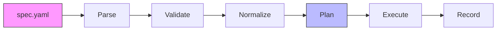
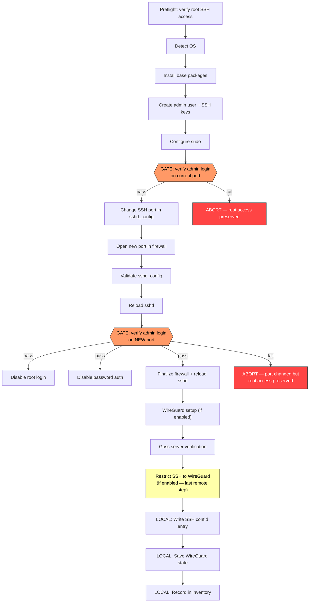

# nodeforge

> **A CLI that safely bootstraps fresh Linux servers into production-ready self-hosted nodes — generating human-readable ops documentation, managing local SSH config, and maintaining a local inventory — all from a single typed YAML spec.**

---

## Installation

### Option 1 — pip (recommended for Python users)

```bash
pip install nodeforge
```

### Option 2 — Standalone binary

Download the pre-built binary for your platform from the [Releases](../../releases) page:

| Platform | File |
|---|---|
| Linux (x86-64) | `nodeforge-linux-amd64` |
| Linux (ARM64) | `nodeforge-linux-arm64` |
| macOS (Intel) | `nodeforge-macos-amd64` |
| macOS (Apple Silicon) | `nodeforge-macos-arm64` |

```bash
chmod +x nodeforge-linux-amd64
sudo mv nodeforge-linux-amd64 /usr/local/bin/nodeforge

# Verify
nodeforge --help
```

### Option 3 — Docker

```bash
docker run --rm ghcr.io/1ops-eu/nodeforge:latest --help
```

With a spec file and SSH key:

```bash
docker run --rm \
  -v ~/.ssh:/root/.ssh:ro \
  -v $(pwd)/my-server.yaml:/spec.yaml:ro \
  ghcr.io/1ops-eu/nodeforge:latest apply /spec.yaml
```

---

## What nodeforge does

1. **Validate** — checks a YAML spec for correctness and safety
2. **Plan** — generates a deterministic, reviewable execution plan
3. **Docs** — renders a human-readable Markdown ops guide from the plan
4. **Apply** — executes the plan safely, enforcing SSH lockout prevention

From a single YAML spec, you get:
- A secure, hardened Linux server (SSH key-only, custom port, ufw, WireGuard)
- A Markdown runbook you can put in your wiki
- A local `~/.ssh/conf.d/` entry for easy SSH access
- A local inventory with full historization

---

## Quick Start

### 1. Bootstrap a fresh server

```bash
# Create your spec
cp examples/bootstrap.yaml my-server.yaml
# Edit: set host.address, login.private_key, admin_user.pubkeys

# Validate
nodeforge validate my-server.yaml

# Preview the plan
nodeforge plan my-server.yaml

# Generate ops docs
nodeforge docs my-server.yaml -o MY_SERVER_BOOTSTRAP.md

# Apply (bootstraps the server)
nodeforge apply my-server.yaml
```

After apply, you can SSH directly:
```bash
ssh my-server-name  # via the ~/.ssh/conf.d/ entry nodeforge created
```

### 2. Install PostgreSQL

```bash
nodeforge apply examples/postgres.yaml
```

### 3. Deploy a Docker container

```bash
nodeforge apply examples/app-container.yaml
```

---

## Commands

```
nodeforge validate <spec.yaml>          Validate a spec file
nodeforge plan     <spec.yaml>          Show the execution plan
nodeforge docs     <spec.yaml> [-o FILE] [--mode guide|commands]
                                         Generate Markdown ops docs
nodeforge apply    <spec.yaml> [--dry-run]
                                         Execute the plan
nodeforge inspect  run <run-id>          Inspect a past run
nodeforge inventory list                 List all servers
nodeforge inventory show <server-id>     Show server details
```

### Global CLI Options

All commands that load specs support these options:

| Option | Description |
|---|---|
| `--env-file PATH` | Load environment variables from a `.env` file before resolving the spec. Variables in the file only apply when not already set in the environment (existing env vars take precedence). |
| `--passthrough` | Leave unresolved `${VAR}` references unchanged instead of erroring. Useful for generating docs or plans from specs with variables you don't want to resolve yet. |

---

## Architecture

```
YAML Spec
  └─ Parse (loader.py)            ← registry lookup: kind -> model class
       └─ Validate (validators.py) ← registry lookup: kind -> validator fn
            └─ Normalize (normalizer.py) ← registry lookup: kind -> normalizer fn
                 └─ Plan (planner.py) ← registry lookup: kind -> planner fn
                      ├─ Docs  (render_markdown.py)
                      └─ Apply (executor.py)
                               ├─ Step dispatch: registry lookup: step.kind -> handler
                               ├─ Remote: SSH via Fabric
                               └─ Local:
                                    ├─ SSH conf.d entry
                                    ├─ WireGuard state
                                    └─ Local inventory
```

**Plan is the single source of truth.** Both docs and apply are generated from the same Plan object — what you review is exactly what executes.

### How Spec Dispatch Works

nodeforge is **not** a keyword scanner. It uses a registry-based dispatch system:

1. Every YAML spec has a `kind` field (e.g., `kind: bootstrap` or `kind: service`).
2. The `kind` value is looked up in an open registry to find the matching Pydantic model, normalizer, validator, and planner.
3. The **planner** inspects which blocks in the spec are populated and generates a deterministic list of `Step` objects. Empty blocks are skipped.
4. The **executor** dispatches each step by its `step.kind` (e.g., `ssh_command`, `gate`, `local_file_write`) via a step handler registry.

This means new spec kinds and step types can be added by external addons without modifying any core source files.

### Registry System

Six open registries power the pipeline — each maps a string key to a callable:

| Registry | Maps | Signature |
|---|---|---|
| `SPEC_REGISTRY` | `kind` -> Pydantic model class | `kind: str -> type` |
| `PLANNER_REGISTRY` | `kind` -> plan-builder | `(spec, ctx) -> list[Step]` |
| `NORMALIZER_REGISTRY` | `kind` -> normalizer | `(spec, ctx) -> None` |
| `VALIDATOR_REGISTRY` | `kind` -> validator | `(spec) -> list[ValidationIssue]` |
| `STEP_HANDLER_REGISTRY` | `step.kind` -> executor handler | `(executor, step) -> StepResult` |
| `HOOKS_REGISTRY` | `kind` -> `KindHooks` lifecycle | dataclass with callbacks |

Built-in kinds (`bootstrap`, `service`) are registered at startup. External addons register via Python `entry_points`:

```toml
# addon's pyproject.toml
[project.entry-points."nodeforge.addons"]
my_addon = "my_addon:register"
```

### KindHooks Lifecycle

Each spec kind can declare lifecycle hooks via `KindHooks`:

- `needs_key_generation` — auto-generate SSH key pairs before normalization
- `ssh_port_fallback` — on re-runs, try `ssh.port` if `login.port` is unreachable
- `on_inventory_record` — post-apply callback to record results in inventory

### SSH Lockout Prevention

The critical bootstrap invariant enforced by the planner:

```
Step 10: [GATE] verify_admin_login_on_new_port
Step 11: disable_root_login         (depends_on: [10])
Step 12: disable_password_auth      (depends_on: [10])
```

Steps 11 and 12 **never execute** unless the gate (SSH login verification) passes. If the gate fails, the plan aborts and you keep root access.

### Server Verification (Goss)

`nodeforge apply` automatically verifies the server after every successful bootstrap using [Goss](https://github.com/goss-org/goss):

1. Generates a goss spec from the live spec values (ports, users, WireGuard interface, etc.)
2. Installs goss on the remote server if absent
3. Uploads the spec to `~/.goss/<spec-name>.yaml`
4. Accumulates it into a master gossfile `~/.goss/goss.yaml` (so re-running adds to, not replaces, prior specs)
5. Runs `goss -g ~/.goss/goss.yaml validate` and displays a Rich results table

If goss cannot run for any reason, apply prints a **bold yellow warning** and continues — the server is still configured.

To re-run goss manually or check a specific static reference spec:

```bash
# On the server
goss -g ~/.goss/goss.yaml validate

# Via Makefile (copies a static reference spec and runs it)
make test-goss HOST=203.0.113.10 PORT=2222 USER=admin
```

Each example in `examples/ubuntu/` ships as a pair — a nodeforge YAML and a matching `.goss.yaml` reference spec side-by-side in the same folder:

```
examples/ubuntu/
  04-firewall-ssh2222/
    04-firewall-ssh2222.yaml        ← nodeforge spec
    04-firewall-ssh2222.goss.yaml   ← static goss reference
```

### Local State Management

After a successful bootstrap:
- `~/.ssh/conf.d/nodeforge/{host_name}.conf` — SSH alias to the new server
- `~/.nodeforge/inventory.db` — local server inventory (SQLite with versionize historization)
- `~/.nodeforge/runs/` — JSON execution logs
- `~/.goss/` — goss specs and master gossfile deposited by nodeforge
- `~/.wg/nodeforge/{host_name}/` — WireGuard key material and configuration:
  - `private.key` — server Curve25519 private key
  - `public.key` — server public key (derived via PyNaCl)
  - `wg0.conf` — server wg-quick config as deployed
  - `client.key` — auto-generated client private key (stable across re-runs)
  - `client.conf` — client wg-quick config for local use (`wg-quick up client.conf`)
  - `metadata.json` — interface details, peer config, deployment provenance

All paths are overridable via `NODEFORGE_STATE_DIR` — see [Configurable State Directory](#configurable-state-directory).

---

## How It Works Under the Hood

This section traces what happens when you run `nodeforge apply spec.yaml` — from YAML file to configured server.

### Pipeline Overview



The pipeline has six phases. Each phase uses the [registry system](#registry-system) to dispatch by `kind`, so the same pipeline handles `bootstrap`, `service`, and any addon-defined kinds.

### Phase 1: Parse

**Entry:** `nodeforge/specs/loader.py` → `load_spec()`

1. If `--env-file` was provided, loads `KEY=VALUE` pairs into the environment (existing env vars take precedence).
2. Reads the YAML file with `yaml.safe_load()` into a raw Python dict.
3. Reads the `kind` field (e.g. `"bootstrap"`) and looks up the matching Pydantic model class from `SPEC_REGISTRY`.
4. Recursively walks the dict and resolves all `${[prefix:]key[:-default]}` tokens via the resolver registry. In strict mode, an unresolved token is a fatal error with the exact field path. In passthrough mode, it is left as-is.
5. Hydrates the resolved dict into a typed Pydantic v2 model (e.g. `BootstrapSpec`).

**Output:** A fully typed spec object.

### Phase 2: Validate

**Entry:** `nodeforge/specs/validators.py` → `validate_spec()`

Dispatches to the kind-specific validator via `VALIDATOR_REGISTRY`. Validators check for structural and semantic errors — for example:

- SSH port in valid range
- WireGuard config completeness (all required fields when enabled)
- Containers require Docker to be enabled
- Password auth disable requires at least one pubkey

Returns a list of issues, each tagged as `error` (fatal) or `warning` (informational).

### Phase 3: Normalize

**Entry:** `nodeforge/compiler/normalizer.py` → `normalize()`

Resolves everything the planner will need so that plan generation is purely deterministic:

- Applies `NODEFORGE_STATE_DIR` / `local.state_dir` overrides
- Resolves relative paths against the spec file's directory
- Reads SSH public key file contents
- Reads WireGuard server private key, derives public key via PyNaCl
- Generates or reuses the WireGuard client key pair
- Resolves database secrets from environment variables
- Computes local filesystem paths (SSH conf.d, inventory DB)

**Output:** A `NormalizedContext` dataclass with all resolved values — no further I/O is needed.

### Phase 4: Plan

**Entry:** `nodeforge/compiler/planner.py` → `plan()`

Dispatches to the kind-specific planner via `PLANNER_REGISTRY`. The planner inspects which blocks in the spec are populated and generates an ordered list of `Step` objects. Empty or absent blocks produce no steps.

Each `Step` carries:

| Field | Purpose |
|---|---|
| `scope` | `REMOTE` (SSH), `LOCAL` (this machine), or `VERIFY` (verification) |
| `kind` | Dispatch key for the executor — `ssh_command`, `gate`, `local_file_write`, etc. |
| `command` | Shell command string (built by pure functions in `runtime/steps/`) |
| `depends_on` | List of step indices that must succeed before this step runs |
| `gate` | If `true`, failure aborts the entire plan |

The planner also embeds file contents directly into steps (e.g. the Goss verification spec, SSH config fragments) so that the Plan is fully self-contained.

Finally, the Plan is stamped with a `spec_hash` and `plan_hash` for traceability.

**Output:** A `Plan` object — the single source of truth for docs, apply, and inspection.

### Phase 5: Execute

**Entry:** `nodeforge/runtime/executor.py` → `Executor.apply()`

The executor iterates over the Plan's steps in order. For each step:

1. **Check dependencies** — if any step in `depends_on` has failed, this step is skipped.
2. **Check abort** — if a gate has failed, all remaining steps are skipped.
3. **Dispatch** — looks up `STEP_HANDLER_REGISTRY[step.kind]` and calls the handler.

Step handlers:

| Step Kind | What happens |
|---|---|
| `ssh_command` | Runs the command on the remote server via Fabric (Paramiko SSH) |
| `ssh_upload` | Uploads embedded file content to a remote path |
| `gate` | Attempts an SSH login to verify connectivity — failure aborts the plan |
| `verify` | Runs Goss validation or other verification checks |
| `local_file_write` | Writes a file on the local machine (e.g. SSH config) |
| `local_command` | Runs a local operation (backup SSH config, save WireGuard state) |
| `local_db_write` | Initializes or updates the local SQLite inventory |

### Phase 6: Record

After execution completes, three things happen:

1. **Inventory** — the `KindHooks.on_inventory_record` callback writes server metadata and run results to the SQLite inventory (with full historization via versionize triggers).
2. **Run log** — a JSON file is written to `~/.nodeforge/runs/` with per-step timing, status, and output.
3. **Cleanup** — the SSH session is closed.

### Bootstrap Execution Flow

The bootstrap plan is the most complex, with ~25 steps including two safety gates. Here is the dependency and gate structure:



**Key safety properties:**

- **Gate 1** (pre-port-change): Verifies that the admin user can log in with key auth before the SSH port is changed. If this fails, nothing dangerous has happened — the server is still on its original port with root access.
- **Gate 2** (post-port-change): Verifies that the admin user can log in on the new port. `disable_root_login`, `disable_password_auth`, and `finalize_firewall` all carry `depends_on` pointing to this gate — they **never execute** unless the gate passes.
- **WireGuard SSH restriction** is the absolute last remote step. After it runs, only WireGuard-tunneled connections reach SSH. All subsequent steps are local.
- **Goss verification** is non-fatal — a failure is reported but does not abort the plan.

---

## Spec Types

### `kind: bootstrap`

Hardens a fresh Debian/Ubuntu server:
- Creates admin user with SSH key auth
- Configures custom SSH port
- Disables root login and password auth
- Enables UFW firewall
- Configures WireGuard VPN (with auto-generated client key pair)
- Updates local SSH config + inventory

See [examples/bootstrap.yaml](examples/bootstrap.yaml)

### `kind: service`

Installs services on an already-bootstrapped server:
- PostgreSQL (with optional role/database creation)
- Nginx (with site configuration and reverse proxy support)
- Docker
- Docker containers (with health checks)

See [examples/postgres.yaml](examples/postgres.yaml), [examples/nginx-reverse-proxy/](examples/nginx-reverse-proxy/), and [examples/app-container.yaml](examples/app-container.yaml)

### Postflight Checks

Both spec kinds support a `checks` block for post-apply verification:

```yaml
checks:
  - type: ssh
    port: 2222
  - type: wireguard
    interface: wg0
```

---

## Environment Variable Resolution

Spec files support `${VAR}` references (and a richer prefix syntax) that are resolved at load time:

```yaml
kind: service
meta:
  name: my-app
login:
  private_key: ${SSH_KEY_PATH}
postgres:
  create_role:
    name: app
    password_env: ${DB_PASSWORD}
```

### Token syntax

| Token | Meaning |
|---|---|
| `${VAR}` | Bare reference — permanent shorthand for `${env:VAR}`. |
| `${env:VAR}` | Explicit environment variable lookup. |
| `${file:/path/to/file}` | Read file contents (trailing newline stripped). `~` is expanded. Returns `None` if the file does not exist. |
| `${prefix:key}` | Dispatch to any addon-registered resolver (e.g. `sops`, `vault`). |
| `${VAR:-default}` | Use *default* if the resolved value is `None`. Works with any prefix: `${env:HOST:-localhost}`, `${file:/run/secrets/key:-}`, etc. |

### Resolution behaviour

- **Strict mode** (default): unresolved tokens raise an error with the exact field path (e.g., `Unresolved variable '${DB_PASSWORD}' in field 'postgres.create_role.password_env'`).
- **Passthrough mode** (`--passthrough`): unresolved references are left as-is.
- **`.env` file support** (`--env-file .env`): loads variables from a file before resolving, with existing environment variables taking precedence.

### Addon resolvers

External addons can register custom resolver backends (e.g. SOPS, HashiCorp Vault, AWS SSM) by calling `register_resolver(prefix, fn)` in their `register()` function:

```python
from nodeforge.registry import register_resolver

def register():
    register_resolver("sops", _resolve_sops)

def _resolve_sops(key: str) -> str | None:
    # key format: "path/to/secrets.yaml#json.dot.path"
    ...
```

Once registered, specs can use `${sops:secrets.yaml#db.password}` — no changes to core nodeforge required.

### `.env` file format

```env
# Comments are supported
KEY=value
KEY="quoted value"
KEY='single quoted'
export KEY=value    # export prefix is stripped
```

---

## Configurable State Directory

By default, nodeforge stores local state across several directories:

```
~/.ssh/conf.d/nodeforge/   SSH config fragments
~/.wg/nodeforge/           WireGuard key material
~/.nodeforge/inventory.db  Server inventory
~/.nodeforge/runs/         Apply execution logs
```

You can consolidate all state under a single directory for isolation (e.g., testing, CI, multi-environment setups):

### Option 1: Environment variable

```bash
export NODEFORGE_STATE_DIR=/tmp/nodeforge-test
nodeforge apply my-spec.yaml
# All state goes to /tmp/nodeforge-test/{ssh/conf.d/, wg/, inventory.db, runs/}
```

### Option 2: Spec field

```yaml
local:
  state_dir: /opt/nodeforge/staging
```

**Priority order:** `NODEFORGE_STATE_DIR` env var > `local.state_dir` spec field > built-in defaults.

---

## Spec-Relative Path Resolution

Relative paths in specs (e.g., `pubkeys: [.secrets/key.pub]`) are resolved against the **spec file's directory**, not the current working directory. This ensures specs work correctly regardless of where nodeforge is invoked from.

Absolute paths and `~`-prefixed paths are resolved normally.

---

## SSH Key Generation

When applying a bootstrap spec, nodeforge automatically generates missing SSH key pairs. If `admin_user.pubkeys` references a `.pub` file whose corresponding private key doesn't exist, nodeforge generates an ed25519 key pair before proceeding. This is controlled per-kind via the `KindHooks.needs_key_generation` flag.

---

## SSH Port Fallback

On re-runs after a partial bootstrap that already moved SSH to the new port, nodeforge detects that `login.port` (typically 22) is unreachable and automatically falls back to `ssh.port` (the configured post-bootstrap port). This prevents the need to manually edit specs between re-runs.

---

## Addon / Extension Architecture

nodeforge is designed for extensibility. Every dispatch point in the pipeline uses an open registry, so new spec kinds and step execution types can be added by external Python packages without touching core source files.

### Writing an addon

1. Create a Python package with a `register()` function
2. Register it as a `nodeforge.addons` entry point

```toml
# pyproject.toml
[project.entry-points."nodeforge.addons"]
my_addon = "my_addon:register"
```

```python
# my_addon/__init__.py
def register():
    from nodeforge.registry import (
        register_spec_kind, register_planner, register_normalizer,
        register_validator, register_step_handler, register_kind_hooks, KindHooks,
    )
    register_spec_kind("my_kind", MySpec)
    register_normalizer("my_kind", _normalize_my_kind)
    register_planner("my_kind", _plan_my_kind)
    register_validator("my_kind", _validate_my_kind)
    register_step_handler("my_step", _handle_my_step)
    register_kind_hooks("my_kind", KindHooks(on_inventory_record=_record_my_kind))
```

### Built-in addon: Goss

The `goss/` addon is a reference implementation that demonstrates the addon pattern. It generates server-state verification specs from live bootstrap values and runs them post-apply.

---

## Local Inventory

nodeforge maintains a local database with a full historization system (versionize triggers) — every change is recorded with timestamps, so you can see the full history of your server inventory.

```bash
nodeforge inventory list
nodeforge inventory show prod-node-1
```

---

## Development

```bash
# Install with dev dependencies (creates .venv automatically)
make dev

# Run tests
make test            # unit + integration (no live host needed)
make smoke           # smoke tests against all example specs
make test-local      # local integration tests

# Lint and format
make lint            # ruff check + black --check
make fmt             # ruff fix + black format

# Smoke tests against example specs (one at a time)
make validate-example
make plan-example
make docs-example
```

### Building a standalone binary locally

```bash
# Linux / macOS
make build-binary
```

### Building the Docker image locally

```bash
make build-docker
```

---

## Release flow

Releases are triggered by Git tags:

```bash
# Bump version in pyproject.toml and nodeforge/__init__.py, then:
git add pyproject.toml nodeforge/__init__.py
git commit -m "chore(release): bump version to 0.2.0"
git push origin main

git tag v0.2.0
git push origin v0.2.0
```

GitHub Actions will automatically:
1. Build binaries for Linux (amd64, arm64) and macOS (Intel, Apple Silicon)
2. Generate `checksums.txt`
3. Create a GitHub Release with all assets
4. Build and push the Docker image to `ghcr.io/1ops-eu/nodeforge`
5. Publish the wheel to PyPI

---

## What nodeforge is not

- Not a general-purpose config management system (not Ansible)
- Not a Kubernetes orchestrator
- Not a UI/SaaS product
- Not an agent framework

**V1 scope:** Single host, Debian/Ubuntu only, PostgreSQL + Nginx + Docker as the built-in service kinds.

---

## Roadmap

See [ROADMAP.md](ROADMAP.md) for the full milestone plan from v0.1 through v1.0, including planned work on stack deployment, Docker Compose runtime, operational primitives, reusable blueprints, and multi-host operations.

---

## License

Apache 2.0 — see [LICENSE](LICENSE)
